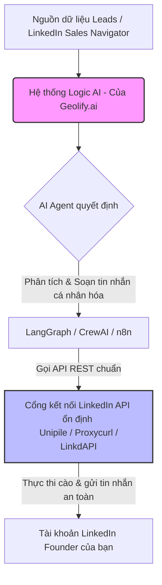

# Khuyến nghị Giải pháp Tự động hóa LinkedIn Outreach cho Geolify.ai

Tài liệu này phân tích chi tiết hai dự án mã nguồn mở **OpenOutreach** và **Linki**, đồng thời mở rộng nghiên cứu sang các giải pháp open-source, self-hosted và các nền tảng có gói miễn phí khác nhằm tối ưu hóa chiến dịch Go-To-Market (GTM) B2B của **Geolify.ai** trên LinkedIn theo hướng **tự động hóa thông minh, cá nhân hóa sâu và không spam với 1 tài khoản duy nhất**.

---

## 1. So sánh Chi tiết: OpenOutreach vs Linki (Quy mô 1 Tài khoản)

Để giúp Geolify.ai có cái nhìn rõ ràng, dưới đây là bảng so sánh kỹ thuật và tính năng của 2 repo này:

| Tiêu chí | OpenOutreach | Linki |
| :--- | :--- | :--- |
| **Công nghệ cốt lõi** | Python, Django, Playwright, SQLite (mặc định) | Node.js, SQLite, Docker Compose |
| **Cơ chế tương tác** | Cào dữ liệu qua Voyager API ẩn danh (sử dụng token lấy từ phiên Playwright đang chạy) | Tự động hóa giao diện trực quan (DOM targeting) bằng trình duyệt thật chạy ngầm |
| **Cá nhân hóa & Tránh Spam** | **Rất cao.** Sử dụng mô hình AI Agent viết tin nhắn dựa trên triết lý **"The Mom Test"** (hỏi phản hồi, tìm điểm đau thực sự, tránh quảng cáo thô). | **Trung bình - Cao.** Tạo tin nhắn cá nhân hóa bằng AI Agent (kết nối qua OpenRouter) dựa trên prompt cấu trúc 3 lớp. |
| **Cơ chế tự học (Auto-learning)** | **Rất thông minh.** Tích hợp mô hình toán học **Gaussian Process Regressor (GPR)** kết hợp **BALD Active Learning** để tự động chấm điểm và tối ưu hóa tệp Leads (ICP) dựa trên phản hồi thực tế. | Không có cơ chế tự học toán học. Chủ yếu dựa trên danh sách lead đầu vào và bộ lọc tĩnh. |
| **Đa kênh (Multichannel)** | Chỉ tập trung vào LinkedIn. | **Hỗ trợ đa kênh.** Kết hợp LinkedIn sequence và Cold Email trong cùng một luồng chiến dịch. Tích hợp sẵn **Apollo.io** để làm giàu email. |

---

### Phân tích Chuyên sâu từng Repo

#### A. OpenOutreach: "Triết gia toán học" tự lọc ICP
*   **Điểm mạnh độc nhất:** 
    *   **BALD Active Learning:** Thay vì bạn phải tự lọc hàng ngàn lead bằng tay, hệ thống sẽ chạy một mô hình học máy trên các vector nhúng (embeddings) 384 chiều của lead. Nó sẽ tự động chọn ra những lead mà nó "chưa chắc chắn nhất" để nhờ LLM gán nhãn, từ đó tối ưu hóa đường biên phân loại khách hàng mục tiêu một cách nhanh nhất với chi phí LLM tối thiểu.
    *   **The Mom Test Philosophy:** Đây là chìa khóa để **không spam**. Agent không gửi tin nhắn chào hàng ngay lập tức. Thay vào đó, nó bắt chuyện dưới góc độ "Founder đi tìm hiểu thị trường", hỏi về các vấn đề họ gặp phải để kích thích tương tác và xây dựng mối quan hệ tin cậy.
*   **Đánh giá độ tương thích:** Với quy mô 1 tài khoản, SQLite mặc định của OpenOutreach chạy cực kỳ hoàn hảo mà không gặp bất kỳ lỗi xung đột dữ liệu (lock database) nào. Hệ thống vận hành trơn tru trên VPS cấu hình thấp.

#### B. Linki: "Chiến binh thực dụng" đa kênh B2B
*   **Điểm mạnh độc nhất:**
    *   **Tích hợp Apollo.io:** Cực kỳ hữu ích cho B2B vì Apollo cung cấp tệp dữ liệu email doanh nghiệp rất chất lượng. Việc kết hợp gửi email lạnh (Cold Email) song song với LinkedIn kết nối giúp tăng tỷ lệ chạm (touchpoints) tới khách hàng.
    *   **Giao diện dễ sử dụng:** Stack Node.js/Docker Compose giúp triển khai nhanh lên các VPS cấu hình nhẹ.
*   **Hạn chế:** Việc dựa hoàn toàn vào DOM targeting để tương tác trực quan trên trình duyệt (thay vì gọi API ngầm như OpenOutreach) có tốc độ chậm hơn và dễ bị lỗi khi LinkedIn thay đổi giao diện (HTML/CSS class thay đổi).

---

## 2. Mở rộng các Giải pháp mã nguồn mở & Gói Free khác

Để phục vụ mục tiêu **tự động hóa thông minh và an toàn**, Geolify.ai có thể tham khảo thêm các giải pháp sau:

### 1. n8n Community Edition (Self-hosted Open-source) - *Khuyên dùng nếu muốn tùy biến cao*
n8n là nền tảng tự động hóa quy trình (workflow automation) mã nguồn mở cực kỳ mạnh mẽ, có thể tự host miễn phí trên Docker.
*   **Cách hoạt động:** Bạn xây dựng workflow kéo thả kết hợp:
    *   **Unofficial LinkedIn API (Node.js):** Sử dụng các thư viện như `linkedin-private-api` để tương tác trực tiếp với API Voyager của LinkedIn thông qua HTTP request (không cần mở trình duyệt ngầm, tiết kiệm tài nguyên VPS).
    *   **AI Agent Node của n8n:** n8n tích hợp sẵn các công cụ AI (LangChain), cho phép bạn tạo một AI Agent kết nối với OpenAI/Claude để phân tích hồ sơ lead và tự động soạn tin nhắn cá nhân hóa.

### 2. inb (Python / Unofficial Voyager API Bot)
Đây là một dự án GitHub mã nguồn mở chuyên biệt để giải quyết bài toán LinkedIn automation mà **không cần mở trình duyệt**.
*   **Cách hoạt động:** `inb` trực tiếp gọi các API ngầm (Voyager API) của LinkedIn bằng Python. Nó giả lập các HTTP request giống hệt ứng dụng LinkedIn trên điện thoại.
*   **Đặc điểm:** Tốc độ chạy cực nhanh và tốn rất ít RAM vì không cần mở trình duyệt Chrome/Playwright. Phù hợp nếu bạn muốn tự viết một script python cực kỳ nhẹ để chạy trên VPS cấu hình thấp.

### 3. SalesGPT (filip-michalsky/SalesGPT) - *AI Sales Agent mã nguồn mở hàng đầu*
Nếu bạn muốn một AI Agent có kịch bản hội thoại bán hàng thực sự thông minh (vượt qua cả một prompt đơn thuần), thì SalesGPT là giải pháp phù hợp nhất.
*   **Tính năng:** Đây là một Agent AI hiểu rõ các **giai đoạn của cuộc hội thoại bán hàng** (qualification, objection handling, closing) dùng cho đa kênh (Email, LinkedIn, SMS).
*   **Điểm mạnh:** Tích hợp tốt với các nguồn tài liệu của Geolify.ai (Knowledge Base) để tự động trả lời các câu hỏi kỹ thuật về sản phẩm của bạn một cách chính xác mà không bị "bịa đặt" thông tin (hallucination).

### 4. FundzWatch AI SDR (Fund-z/fundzwatch-ai-sdr) - *Outreach dựa trên sự kiện*
Đây là một ý tưởng và dự án mã nguồn mở cực kỳ hay mà Geolify.ai có thể học hỏi hoặc áp dụng trực tiếp.
*   **Cách hoạt động:** Thay vì đi spam bừa bãi, Agent này sẽ giám sát các **sự kiện kinh doanh** (ví dụ: một công ty B2B vừa gọi được vốn vòng mới, có sự thay đổi nhân sự cấp cao, hoặc vừa mở văn phòng ở địa điểm mới) để làm lý do bắt chuyện (trigger-based outreach).

---

## 3. Thực tế thị trường: Vấn đề "Outdated" của các giải pháp Open-source & Hướng đi bền vững cho B2B Startup

**Hầu hết các dự án LinkedIn automation mã nguồn mở trên GitHub đều rất nhanh bị lỗi thời (outdated) và ngừng hoạt động.** 

### Nguyên nhân cốt lõi:
1. **LinkedIn nâng cấp bảo mật liên tục:** LinkedIn áp dụng các hệ thống phát hiện bot rất mạnh (Cloudflare, Akamai, kiểm tra dấu chân thiết bị - device fingerprinting, và các thách thức JavaScript ngầm).
2. **Thay đổi cấu trúc giao diện (DOM):** Đối với các công cụ dùng Selenium/Playwright để click trực quan (như Linki), chỉ cần LinkedIn đổi tên một class HTML hoặc thay đổi vị trí một nút bấm, toàn bộ mã nguồn bot sẽ bị lỗi (crash) và cần lập trình viên sửa code thủ công ngay lập tức.
3. **Chi phí bảo trì khổng lồ:** Việc duy trì một hệ thống cào/tự động hóa LinkedIn hoạt động ổn định 24/7 đòi hỏi cập nhật code hàng tuần. 

---

### Giải pháp kiến trúc bền vững cho Geolify.ai (Founder-focused)

Để xây dựng một hệ thống SDR tự động hóa LinkedIn không bị hỏng sau vài tháng và không làm ban tài khoản của bạn, Geolify.ai nên áp dụng **mô hình kiến trúc lai (Hybrid Architecture)**:



1. **Tách biệt phần "Trí tuệ" (Logic AI) và phần "Cơ bắp" (Thao tác LinkedIn):**
   * **Phần Logic AI (Bạn sở hữu 100%):** Dùng các framework mã nguồn mở như **LangGraph**, **CrewAI** hoặc **n8n**. Đây là phần phân tích tệp khách hàng, gán nhãn ICP (như cơ chế GPR Active Learning của OpenOutreach) và sinh tin nhắn cá nhân hóa (như triết lý The Mom Test). Phần này chạy trên server của bạn, gọi LLM (Claude/GPT), và **không bao giờ lo bị LinkedIn làm hỏng** vì nó không tương tác trực tiếp với LinkedIn.
   * **Phần Thao tác LinkedIn (Thuê dịch vụ cổng API):** Thay vì tự chạy Playwright/Selenium và lo sửa lỗi chọn phần tử HTML bị hỏng, bạn hãy gọi qua các API trung gian trả phí có gói dùng thử (như **Unipile**, **Proxycurl**). 
     * Các dịch vụ này có đội ngũ kỹ sư trực chiến 24/7 để bảo trì hệ thống cào dữ liệu và gửi tin nhắn qua LinkedIn.
     * Họ cung cấp các API REST rất ổn định và bền vững (ví dụ: `POST /send-connection` hay `POST /send-message`). Bạn chỉ cần trả một khoản phí rất nhỏ tính theo lượt sử dụng hoặc theo tháng, đổi lại hệ thống của bạn sẽ chạy mượt mà quanh năm mà không tốn công sửa lỗi code.

---

## 4. Khuyên dùng & Hướng dẫn Tùy biến Kỹ thuật cho Geolify.ai (1 Tài khoản)

Nếu Geolify.ai chọn giải pháp **OpenOutreach** làm nền tảng cốt lõi (vì đây là dự án có triết lý tiếp cận không spam và lọc lead bằng Bayesian thông minh nhất hiện tại), bạn nên tùy biến nó để chạy qua 1 Proxy cố định thiết lập từ file `.env` môi trường.

### Hướng dẫn Cập nhật cơ chế khởi tạo trình duyệt Playwright để sử dụng Proxy
1. Mở file [linkedin/browser/login.py](file:///Users/gn/Documents/Gnoc/Github/OpenOutreach/linkedin/browser/login.py).
2. Sửa hàm `launch_browser` để nhận cấu hình Proxy từ biến môi trường:
   ```python
   import os

   def launch_browser(storage_state=None):
       logger.debug("Launching Playwright")
       playwright = sync_playwright().start()
       
       launch_args = {"headless": True, "slow_mo": BROWSER_SLOW_MO}
       
       # Đọc cấu hình proxy duy nhất từ biến môi trường
       proxy_server = os.environ.get("PROXY_SERVER")
       proxy_user = os.environ.get("PROXY_USERNAME")
       proxy_pass = os.environ.get("PROXY_PASSWORD")
       
       proxy_config = None
       if proxy_server:
           proxy_config = {"server": proxy_server}
           if proxy_user and proxy_pass:
               proxy_config["username"] = proxy_user
               proxy_config["password"] = proxy_pass
               
       if proxy_config:
           launch_args["proxy"] = {"server": proxy_config["server"]}
           
       browser = playwright.chromium.launch(**launch_args)
       
       context_args = {"storage_state": storage_state}
       if proxy_config and "username" in proxy_config:
           context_args["proxy"] = proxy_config
           
       context = browser.new_context(**context_args)
       context.set_default_timeout(BROWSER_DEFAULT_TIMEOUT_MS)
       context.set_default_navigation_timeout(BROWSER_DEFAULT_TIMEOUT_MS)
       Stealth().apply_stealth_sync(context)
       page = context.new_page()
       return page, context, browser, playwright
   ```

---

> [!IMPORTANT]
> **Quy tắc Vàng để bảo vệ tài khoản LinkedIn:**
> *   **Giới hạn số lượng:** Không bao giờ gửi quá 10-15 lời mời kết bạn hoặc tin nhắn mỗi ngày trên tài khoản của bạn.
> *   **Proxy sạch:** Bắt buộc sử dụng một Residential Proxy cố định (IPv4 tĩnh) thuộc quốc gia của đối tượng khách hàng mục tiêu để tránh bị LinkedIn quét hành vi đăng nhập bất thường.
