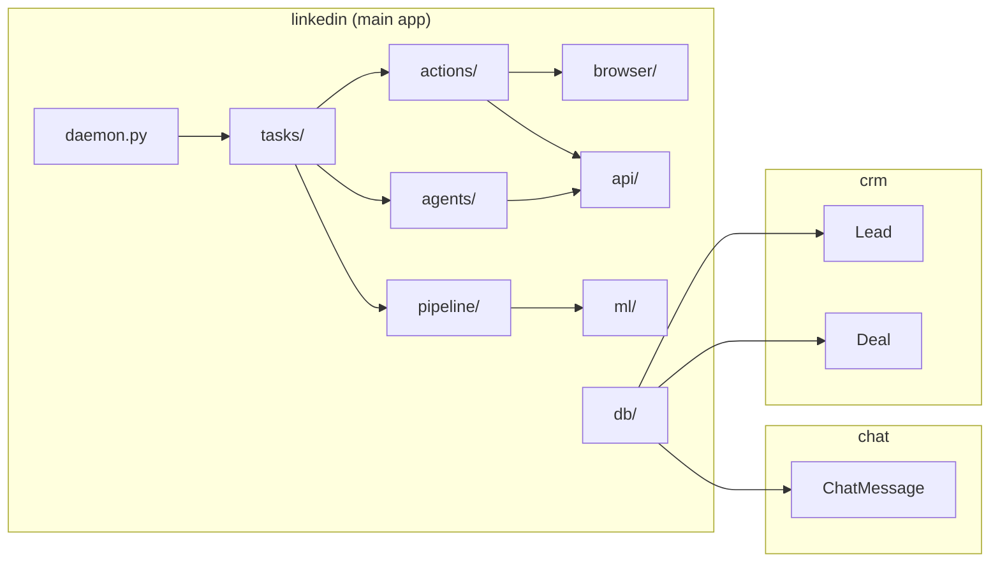
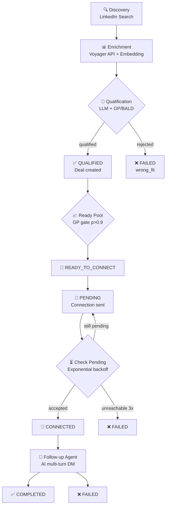

# OpenOutreach — Phân Tích Toàn Diện

## Tổng quan

**OpenOutreach** là công cụ **tự động hóa LinkedIn outreach mã nguồn mở, self-hosted** cho B2B lead generation. Điểm khác biệt: **không cần danh sách leads** — chỉ cần 3 input:

1. Tài khoản LinkedIn (email + password)
2. API key LLM (OpenAI, Anthropic, hoặc bất kỳ OpenAI-compatible)
3. Mô tả sản phẩm + thị trường mục tiêu (ICP)

Hệ thống tự tìm kiếm, đánh giá, kết nối và follow-up với khách hàng tiềm năng.

> [!NOTE]
> **License:** GPLv3 — self-host OK, fork-and-distribute phải open source.

---

## Tech Stack

| Layer | Technology |
|-------|-----------|
| Language | Python 3.12+ |
| Framework | Django 5.2+ (ORM + Admin) |
| Database | SQLite (`data/db.sqlite3`) |
| Browser Automation | Playwright + playwright-stealth |
| LinkedIn API | Voyager API (internal, via browser JS injection) |
| AI Agent Framework | pydantic-ai-slim (7 providers) |
| ML | scikit-learn (Gaussian Process Regressor) |
| Embeddings | FastEmbed — BAAI/bge-small-en-v1.5 (384-dim) |
| Templates | Jinja2 |
| Container | Docker (Playwright base image) |
| VNC | xvfb + x11vnc + noVNC (port 6080) |
| Encryption | Fernet + PBKDF2 (Django SECRET_KEY derived) |

---

## Kiến trúc tổng thể

### 3 Django Apps



### Pipeline Flow chính



---

## Data Models

### Entity Relationship

```mermaid
erDiagram
    SiteConfig ||--|| LLM_Config : "singleton pk=1"
    Campaign }|--|{ User : "M2M users"
    Campaign ||--o{ SearchKeyword : has
    Campaign ||--o{ ActionLog : has
    Campaign ||--o{ Deal : has
    User ||--o| LinkedInProfile : "1:1"
    Lead ||--o{ Deal : has
    Lead ||--o{ ChatMessage : "GenericFK"
    Deal }o--|| Campaign : belongs_to
    Deal }o--|| Lead : belongs_to
    Task ||--o| Deal : references

    SiteConfig {
        str llm_provider
        str llm_api_key
        str ai_model
        str llm_api_base
    }

    Campaign {
        str name "unique"
        text product_docs
        text campaign_objective
        str booking_link
        bool is_freemium
        float action_fraction
        json seed_public_ids
        binary model_blob "joblib GP model"
    }

    LinkedInProfile {
        str linkedin_username
        str linkedin_password "encrypted"
        bool active
        int connect_daily_limit "20"
        int connect_weekly_limit "100"
        int follow_up_daily_limit "30"
        json cookie_data "session persistence"
        FK self_lead "→ Lead"
    }

    Lead {
        url linkedin_url "unique"
        str public_identifier "unique"
        str urn "unique, nullable"
        binary embedding "384-dim float32"
        bool disqualified "permanent"
    }

    Deal {
        FK lead "→ Lead"
        FK campaign "→ Campaign"
        str state "ProfileState enum"
        str outcome "Outcome enum"
        int connect_attempts
        int backoff_hours
        json profile_summary "mem0 facts"
        json chat_summary "mem0 facts"
    }

    Task {
        str task_type "connect/check_pending/follow_up"
        str status "pending/running/completed/failed"
        datetime scheduled_at
        json payload
    }

    ChatMessage {
        FK content_type "GenericFK"
        int object_id "→ Lead.pk"
        text content
        str linkedin_urn "unique, dedup"
        bool is_outgoing
    }
```

### ProfileState Enum (State Machine)

```
QUALIFIED → READY_TO_CONNECT → PENDING → CONNECTED → COMPLETED
                                  ↓                      ↓
                                FAILED                  FAILED
```

### Outcome Enum
`converted` · `not_interested` · `wrong_fit` · `no_budget` · `has_solution` · `bad_timing` · `unresponsive` · `unknown`

---

## Module Chi Tiết

### 1. Daemon ([daemon.py](file:///Users/gn/Documents/Gnoc/Github/Stelixx%20CDP/OpenOutreach/linkedin/daemon.py))

Single-threaded task queue worker chạy vòng lặp vô hạn:

```
while True:
    1. Kiểm tra active hours (9h-19h, skip Sat/Sun) → sleep nếu ngoài giờ
    2. claim_next() — lấy task PENDING đã đến scheduled_at
    3. Không có task → reconcile() từ CRM state → sleep chờ
    4. Chạy handler (connect/check_pending/follow_up)
    5. rhythm.maybe_break() — burst 45-65min, break 10-20min
```

**Human-rhythm pacing:** Mô phỏng hành vi con người — burst hoạt động 45-65 phút rồi nghỉ 10-20 phút.

### 2. Tasks ([tasks/](file:///Users/gn/Documents/Gnoc/Github/Stelixx%20CDP/OpenOutreach/linkedin/tasks))

| File | Chức năng |
|------|-----------|
| [scheduler.py](file:///Users/gn/Documents/Gnoc/Github/Stelixx%20CDP/OpenOutreach/linkedin/tasks/scheduler.py) | **Single source of truth** cho Task rows. 3 tầng: enqueue → state-transition hook → reconcile |
| [connect.py](file:///Users/gn/Documents/Gnoc/Github/Stelixx%20CDP/OpenOutreach/linkedin/tasks/connect.py) | Rate limit → find_candidate (pipeline) → check status → send connection → reschedule |
| [check_pending.py](file:///Users/gn/Documents/Gnoc/Github/Stelixx%20CDP/OpenOutreach/linkedin/tasks/check_pending.py) | Probe connection status → double backoff (24h→48h→96h...) → trigger next state |
| [follow_up.py](file:///Users/gn/Documents/Gnoc/Github/Stelixx%20CDP/OpenOutreach/linkedin/tasks/follow_up.py) | Rate limit → too_soon_to_nudge? → materialize summary → run agent → execute decision |

### 3. Actions ([actions/](file:///Users/gn/Documents/Gnoc/Github/Stelixx%20CDP/OpenOutreach/linkedin/actions))

| Action | Chức năng |
|--------|-----------|
| [connect.py](file:///Users/gn/Documents/Gnoc/Github/Stelixx%20CDP/OpenOutreach/linkedin/actions/connect.py) | Gửi connection request KHÔNG note. Fallback: Direct button → More menu → "Send now" |
| [status.py](file:///Users/gn/Documents/Gnoc/Github/Stelixx%20CDP/OpenOutreach/linkedin/actions/status.py) | Kiểm tra trạng thái: API degree → UI fallback (Pending/Connect/Connected) |
| [search.py](file:///Users/gn/Documents/Gnoc/Github/Stelixx%20CDP/OpenOutreach/linkedin/actions/search.py) | LinkedIn People search, navigate, discover & enrich leads |
| [message.py](file:///Users/gn/Documents/Gnoc/Github/Stelixx%20CDP/OpenOutreach/linkedin/actions/message.py) | Gửi DM: Thread URL → API fallback. CSS selector fallback chains |
| [conversations.py](file:///Users/gn/Documents/Gnoc/Github/Stelixx%20CDP/OpenOutreach/linkedin/actions/conversations.py) | Tìm conversation URN, parse messages, sync data |
| [profile.py](file:///Users/gn/Documents/Gnoc/Github/Stelixx%20CDP/OpenOutreach/linkedin/actions/profile.py) | Profile navigation utilities |

> [!IMPORTANT]
> Mỗi action dùng **selector fallback chains** — danh sách CSS selectors thử theo thứ tự vì LinkedIn A/B testing UI liên tục.

### 4. Pipeline ([pipeline/](file:///Users/gn/Documents/Gnoc/Github/Stelixx%20CDP/OpenOutreach/linkedin/pipeline))

Kiến trúc **generator chains** — backfill tự động khi pool rỗng:

```
find_candidate() = next(ready_source, None)
                        ↓
              ready_source ← pulls from qualify_source
                        ↓
             qualify_source ← pulls from search_source  
                        ↓
              search_source ← yields from LLM keywords
```

| Module | Chức năng |
|--------|-----------|
| [pools.py](file:///Users/gn/Documents/Gnoc/Github/Stelixx%20CDP/OpenOutreach/linkedin/pipeline/pools.py) | Composable generators: ready → qualify → search. Adaptive threshold |
| [qualify.py](file:///Users/gn/Documents/Gnoc/Github/Stelixx%20CDP/OpenOutreach/linkedin/pipeline/qualify.py) | BALD acquisition → LLM qualify → promote/disqualify |
| [ready_pool.py](file:///Users/gn/Documents/Gnoc/Github/Stelixx%20CDP/OpenOutreach/linkedin/pipeline/ready_pool.py) | GP confidence gate: P(f>0.5) > 0.9 → READY_TO_CONNECT |
| [search.py](file:///Users/gn/Documents/Gnoc/Github/Stelixx%20CDP/OpenOutreach/linkedin/pipeline/search.py) | LLM generate keywords → LinkedIn search → enrich |
| [freemium_pool.py](file:///Users/gn/Documents/Gnoc/Github/Stelixx%20CDP/OpenOutreach/linkedin/pipeline/freemium_pool.py) | Seed profiles + KitQualifier (pre-trained) |

### 5. ML System ([ml/](file:///Users/gn/Documents/Gnoc/Github/Stelixx%20CDP/OpenOutreach/linkedin/ml))

**BayesianQualifier** ([qualifier.py](file:///Users/gn/Documents/Gnoc/Github/Stelixx%20CDP/OpenOutreach/linkedin/ml/qualifier.py)):
- `StandardScaler → GaussianProcessRegressor` (scikit-learn)
- **BALD Active Learning:** MC sampling 100 samples từ GP posterior
- Explore/exploit: `n_neg > n_pos → exploit`, else → explore (BALD information gain)
- Class balancing: subsample majority ≤ 2x minority
- Lazy refit + persist via joblib → `Campaign.model_blob`

**Embeddings** ([embeddings.py](file:///Users/gn/Documents/Gnoc/Github/Stelixx%20CDP/OpenOutreach/linkedin/ml/embeddings.py)):
- Model: `BAAI/bge-small-en-v1.5` (384-dim), lazy-load singleton
- Profile text: headline + summary + location + industry + positions + educations → lowercase

### 6. LLM Integration ([llm.py](file:///Users/gn/Documents/Gnoc/Github/Stelixx%20CDP/OpenOutreach/linkedin/llm.py))

**Giải quyết xung đột asyncio:** Playwright sync API + pydantic-ai async API → dedicated daemon thread với persistent event loop (`_AgentRunner`). `run_agent_sync(coro)` bridge sync ↔ async.

**7 LLM providers:** OpenAI, Anthropic, Google, Groq, Mistral, Cohere, OpenAI-compatible

**4 use cases:**
1. **Qualification** → `QualificationDecision` structured output
2. **Follow-up** → `FollowUpDecision` structured output
3. **Search keywords** → `SearchKeywords` structured output
4. **Fact extraction** → mem0-style fact lists + reconciliation

### 7. Follow-up Agent ([agents/follow_up.py](file:///Users/gn/Documents/Gnoc/Github/Stelixx%20CDP/OpenOutreach/linkedin/agents/follow_up.py))

**Single LLM call** với structured output `FollowUpDecision`:

| Field | Values |
|-------|--------|
| `action` | `send_message` · `mark_completed` · `wait` |
| `message` | Nội dung DM (khi send_message) |
| `outcome` | Outcome enum (khi mark_completed) |
| `follow_up_hours` | Thời gian chờ đến lần tiếp |

**Context cho LLM:**
- `profile_summary` — mem0-style facts từ Voyager profile
- `chat_summary` — mem0-style facts từ chat history (chỉ incoming messages)
- 6 tin nhắn gần nhất (verbatim)
- `days_since_last_outgoing`, `unanswered_outgoing` count

**Nudge throttling:** `MIN_DAYS_PER_UNANSWERED = 3` → 1 unanswered = 3d, 2 = 6d, 3 = 9d

**Prompt strategy ("Mom Test"):** Discovery first, pitch chỉ khi có signal, tone casual (1-3 câu), tự chọn ngôn ngữ.

### 8. Voyager API ([api/](file:///Users/gn/Documents/Gnoc/Github/Stelixx%20CDP/OpenOutreach/linkedin/api))

**Core innovation:** `PlaywrightLinkedinAPI` inject `fetch()` **bên trong Chromium page context** — kế thừa tất cả browser-native headers (cookies, x-li-track, sec-ch-*...) thay vì dùng HTTP client riêng.

| Endpoint | Mục đích |
|----------|----------|
| `/identity/dash/profiles` (decoration 91) | Full profile scrape |
| `/identity/dash/profiles` (decoration 120) | Connection degree |
| `/messaging/conversations` | Find conversation URN |
| `/messaging/messages` | Fetch/send messages |

### 9. DB Layer ([db/](file:///Users/gn/Documents/Gnoc/Github/Stelixx%20CDP/OpenOutreach/linkedin/db))

| Module | Chức năng |
|--------|-----------|
| [leads.py](file:///Users/gn/Documents/Gnoc/Github/Stelixx%20CDP/OpenOutreach/linkedin/db/leads.py) | Lead CRUD, discover & enrich |
| [deals.py](file:///Users/gn/Documents/Gnoc/Github/Stelixx%20CDP/OpenOutreach/linkedin/db/deals.py) | Deal/state operations, `set_profile_state()` |
| [summaries.py](file:///Users/gn/Documents/Gnoc/Github/Stelixx%20CDP/OpenOutreach/linkedin/db/summaries.py) | mem0-style lazy fact summaries |
| [chat.py](file:///Users/gn/Documents/Gnoc/Github/Stelixx%20CDP/OpenOutreach/linkedin/db/chat.py) | Sync conversation, upsert ChatMessage |

### 10. Browser Session ([browser/](file:///Users/gn/Documents/Gnoc/Github/Stelixx%20CDP/OpenOutreach/linkedin/browser))

- **AccountSession:** Playwright browser lifecycle wrapper
- Cookie persistence: `cookie_data` JSON field trên LinkedInProfile
- `BROWSER_SLOW_MO = 200ms`, human-like typing (50-200ms/char)
- VNC: port 5900 (native) / 6080 (noVNC web) để xem live

---

## Smart Rate Limiting

| Dimension | Default | Configurable |
|-----------|---------|--------------|
| Connect daily | 20 | per LinkedInProfile |
| Connect weekly | 100 | per LinkedInProfile |
| Follow-up daily | 30 | per LinkedInProfile |
| Burst duration | 45-65 min | conf.py |
| Break duration | 10-20 min | conf.py |
| Active hours | 9h-19h | ENABLE_ACTIVE_HOURS |
| Weekend | Off (Sat/Sun) | conf.py |
| Min action interval | 120s | conf.py |
| Enrichment delay | 6-10s/profile | conf.py |
| Max enrichment/page | 10 | conf.py |

---

## Deployment

### Docker (recommended)
```bash
docker run --pull always -it \
  -p 5900:5900 -p 6080:6080 \
  -v ~/.openoutreach/data:/app/data \
  ghcr.io/eracle/openoutreach:latest
```

### Docker Compose (production)
- **web service:** migrate + setup_crm + runserver :8000
- **daemon service:** DISPLAY=:99, VNC, ports 6080/5900
- Shared volume `django_data` at `/app/data`

### CI/CD
- `tests.yml` — pytest on push/PR
- `deploy.yml` — test → build → push `ghcr.io/eracle/openoutreach` → trigger DigitalOcean rebuild

---

## Tests

**21 test files, ~2900+ dòng**, sử dụng pytest + pytest-django + factory-boy:

| Area | Files | Coverage |
|------|-------|----------|
| Action logs & rate limits | test_action_log.py | 12 tests |
| Pipeline pools | test_pools.py | 12 tests |
| ML qualifier (GP/BALD) | ml/test_qualifier.py | 17 tests |
| Voyager API parsing | api/test_voyager.py | 25+ tests |
| DB operations | db/test_profiles.py | 18 tests |
| mem0 summaries | db/test_summaries.py | 14 tests |
| Task handlers | tasks/test_tasks.py | 14 tests |
| Follow-up agent | agents/test_follow_up.py | 4 tests |
| Embeddings | ml/test_embeddings.py | 8 tests |
| Scheduling | test_schedule.py | 9 tests |
| GDPR | test_gdpr.py | 7 tests |
| Crypto | test_crypto.py | 4 tests |
| Browser selectors | browser/test_connect_selectors.py | 5+ tests |
| Lazy enrichment | db/test_lazy_enrichment.py | 9 tests |
| Ready pool | test_ready_pool.py | 5 tests |
| Reconciliation | test_reconcile.py | 7 tests |
| Qualification | test_qualify.py | 3 tests |

---

## Legal & GDPR

> [!WARNING]
> - LinkedIn ToS **cấm automation** — rủi ro ban tài khoản
> - Auto newsletter subscription cho non-GDPR accounts
> - Freemium mode tự gửi promotional messages từ tài khoản user
> - Không có consent/lawful basis mechanism

**GDPR Roadmap (7 workstreams):**
A. Differential Privacy Embeddings · B. Credential Security (Fernet) · C. PII Cleanup · D. Data Retention (6-month TTL) · E. Right to Erasure · F. Remove Stored Names · G. Data Portability

---

## Roadmap & Geolify.ai Context

### Planned Features (từ [idea_and_implementation_plan.md](file:///Users/gn/Documents/Gnoc/Github/Stelixx%20CDP/OpenOutreach/_docs/idea_and_implementation_plan.md)):
1. **Telegram reporting & alerts** — daily report + real-time error alerts
2. **Auto-withdraw old invites** — clean pending > 21 ngày
3. **AI Message Approval Gate** — review/approve qua Telegram
4. **Self-healing & Error Recovery** — auto-retry browser crashes (max 2)
5. **Intent Detection** — classify high/low/none → alert hot leads
6. **Smart Active Hours** — optimize theo timezone lead
7. **Link tracking** — personalized URLs + click tracking
8. **Stelixx CDP integration** — webhook events + CSV lead import

### Current Pilot (Geolify.ai):
- VPS Nhật Bản (16GB RAM), tài khoản `nv-cong`
- 2 campaigns: Agency Track + Solopreneur Track
- LLM: `gpt-oss-120b:free` qua OpenRouter
- Config conservative: 12 connects/day, 70/week

---

## Ghi chú kỹ thuật quan trọng (từ CLAUDE.md)

> [!IMPORTANT]
> - `run_agent_sync()` drives LLM coroutines trên worker thread (tránh conflict Playwright sync + asyncio)
> - Lead KHÔNG cache raw profile — lazy scrape via `Lead.get_profile(session)`
> - `Deal.chat_summary` chỉ extract facts từ **incoming messages**
> - **Crash on unexpected errors** — chỉ try/except cho expected errors
> - **No API backward compat** — rename/delete freely, chỉ DB migrations cần cẩn thận
> - Luôn dùng `.venv/bin/python`

---

## Cấu trúc thư mục tổng quan

```
OpenOutreach/
├── linkedin/                    # Main app — LinkedIn automation
│   ├── actions/                 # Browser interactions (connect, search, message...)
│   ├── agents/                  # AI agents (follow_up only)
│   ├── api/                     # Voyager API client & messaging
│   │   └── messaging/           # Message send/fetch via API
│   ├── browser/                 # Playwright session management
│   ├── db/                      # Data layer (leads, deals, summaries, chat)
│   ├── management/commands/     # Django CLI (rundaemon, onboard, add_seeds, reset_data)
│   ├── ml/                      # ML pipeline (GP qualifier, embeddings)
│   ├── pipeline/                # Candidate selection (search→qualify→ready)
│   ├── setup/                   # Setup utilities
│   ├── tasks/                   # Task handlers (connect, check_pending, follow_up)
│   ├── templates/prompts/       # Jinja2 LLM prompts
│   ├── vendor/                  # Vendored code (mem0 prompts)
│   ├── daemon.py                # Main worker loop
│   ├── models.py                # Campaign, LinkedInProfile, Task, SiteConfig...
│   ├── llm.py                   # LLM integration (async bridge)
│   ├── conf.py                  # Configuration constants
│   └── ...
├── crm/                         # CRM app — Lead, Deal models
│   └── models/
├── chat/                        # Chat app — ChatMessage model
├── docs/                        # Official documentation
├── _docs/                       # Internal docs (Geolify.ai planning)
├── compose/linkedin/            # Docker build context
├── data/                        # SQLite DB + fastembed cache
├── tests/                       # 21 test files, ~2900+ lines
├── requirements/                # Python dependencies
├── ARCHITECTURE.md              # Architecture documentation
├── CLAUDE.md                    # AI coding guidelines
├── README.md                    # Project overview
└── docker-compose.yml           # Production compose
```
